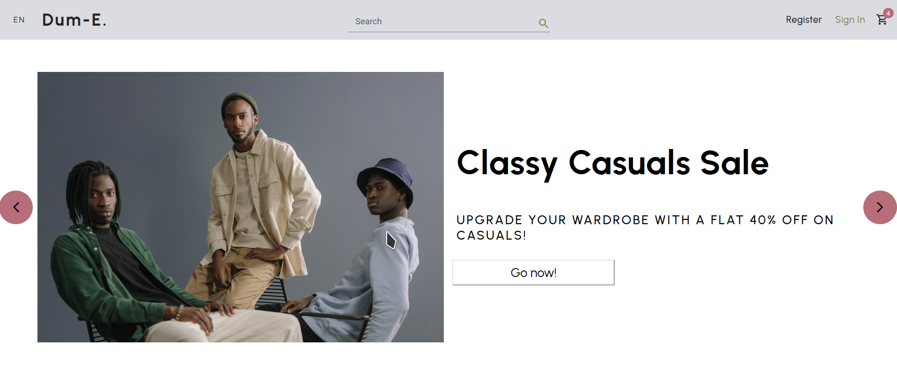

# Dum-E Commerce

Fake e-commerce application built with ReactJs

## Current State - I just started

- React is entirely new to me, and this might take a while, but seems like a fun old time
- I'm also now settling into a format for my ReadMe's: Title, abstract, current state, technologies used, what's next
- Navbar is done, and it looks good so far
- Started on Hero Carousel for new arrivals / hot deals etc.

## What's inside?

- ReactJs
  - Atomic Components and CSS
  - Conditional Classes
- Material UI components

## Next up

- Reusable Components! (That can be used across projects, even)
- Maybe SASS for better CSS
- Cute animations (Framer motion?)
- Gallery / Grid sort of thing to display products?
- Carousel for new arrivals / sales / deals?
- Modals for registering, signing up
- Product details page
- Organize by category? Filters?
